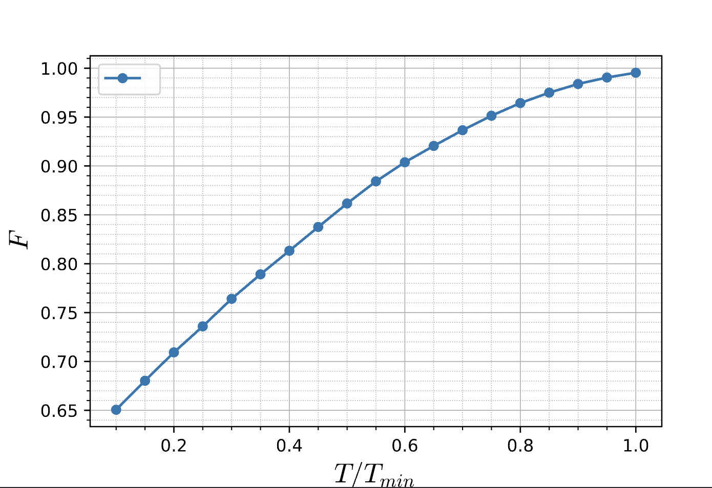
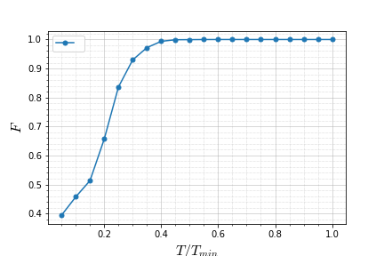
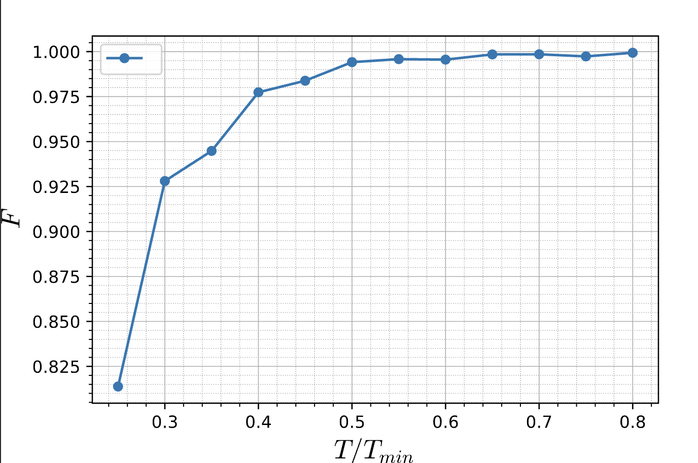

<div align="center">
  
</div>

## Description
The speed of elementary quantum gates, particularly two-qubit gates, ultimately sets the limit on the speed at which quantum circuits can operate. In this work, we expand our computational system to a qutrit space and leverage our larger space to generate two-qubit gates at much faster speeds. Here, we show for specific two-qubit gates, we can theoretically achieve a 3x speed-up using experimentally feasible coupling regimes, and we prove that this speed-up is maximal for our regime. We accomplish this speed-up by utilizing a machine learning-inspired optimal control method, and our optimal control method also incorporates all error sources, leakage and cross-talk, from single-qudit drives. Using our method, we can nearly saturate our speed-up while accounting for non-instantaneous single-qudit drives and mitigating all controllable error sources. Our method generalizes for all weakly anharmonic systems, and thus our optimal control method is highly applicable for many experimental platforms and would significantly increase circuit depth. 

## Setup
1. Install a Python environment with version 3.7 and pip.
2. Make sure a version of Bash is installed on machine. 
3. Install GitHub repository on local machine. Ex(Linux/Unix): `git install https://github.com/b-basyildiz/QuOpt.git`
4. Install required packages through `pip install requirements.txt` while in local environment.
5. All set to run! 

## Use
To run our Optimal Control Protocol, while in the local environment move to the Optimal_Control directory and open QOC.bash through `vim QOC.bash`, and this will look like
```vim
quditType="Qubit" 
gateType="CNOT" 

couplingType="XX"
maxDriveStrength=20

crossTalk="True" 
contPulse="False"
leakage="False"
minimizeLeakage="False"

anharmonicity=5 
staggering=15

ode="SRK2" 
h=0.005
alpha=0.5

segmentCount=8
g=1 
minTime=1.0 
maxTime=1.2
points=1

randomSeedCount=-1 
iterationCount=5000 
optimizer="SGD"

HPC="False"
```

Here is a description for each parameter with their respective input values in *italics*:
- `quditType`: number of energy levels in system (*Qubit* for 2-level system, *Qutrit* for 3-level system)
- `gateType`: target gate (EX: *CNOT*, *iSWAP*, etc.)

- `couplingType`: coupling type between qudits (EX: *XX*, *ZZ*, etc.)
- `maxDriveStrength`: maximum strength of single qudit drives. In units of coupling strength, and input *-1* for uncapped drive strength
  
- `crossTalk`: Boolean. *"True"* to incorporate cross-talk into system. *"False"* otherwise.
- `contPulse`: Boolean. *"True"* to have continuous pulse shapes (sin^2(x)) into model. *"False"* otherwise. Pulse shape can be altered
- `leakage`: Boolean. *"True"* to have leakage to a higher energy level incorporated into system. *"False"* otherwise.
- `minimizeLeakage`: Boolean. *True* to have higher energy state populations to be minimized. *False* otherwise. 

- `anharmonicity`: detuning of energy states (in units of the coupling strength). Anharmonicity is the same for both qudits. *This will be changed in the future such that each qudit will have its own anharmonicity parameter.*
- `staggering`: staggering between two qudits (in units of coupling strength)

- `ode`: Numerical ODE solver for time-dependent systems. (Either *RK2* or *SRK2*)
- `h`: Step size for ODE Solver.
- `alpha`: tuned parameter for minimizing higher energy state populations. Higher weight leads to stronger supression of higher energy state populations and vice versa. 

- `segmentCount`: Number of microwave pulse segments applied in given time.
- `g`: coupling strength.
- `minTime`: minimum time to generate gate in point spread
- `maxTime`: maximum time to generate gate in point spread
- `points`: number of points in spread

- `randomSeedCount`: amount of random seeds to run in parallel (-1 for a fixed seed)
- `iterationCount`: number of iterations for optimizer
- `optimizer`: Optimizer used to tune parameters (SGD: Stochastic Gradient Descent, ADAM, and others (see helpFuncs.py))

- `HPC`: Boolean. *True* to integrate with high performance computers, essentially runs protocol through slurm files. *False* to run locally or in native python environments.

For more info on the availible parameters, see `helperFuncs.py`. 


Once the above parameters are set, run `bash QOC.bash` in the local terminal and the output will be saved in a created folder called `Data`. This folder will contain subfolders based on what type of model is chosen (ClosedSystem, Leakage, CrossTalk, and CTL) for each model respectively, and the output will also contain folders called `Fidelities`, where the maximum fidelity for a given time is stored, and `Weights`, where the pulse parameters to generate a given gate are stored. 

## Examples
We will detail specific examples to illustrate the codebase. 

### Qubit Example
Here we will do an optimization for a CNOT gate in 8 segments with XX coupling for a qubit system with no error sources. To run this example, see the bash script in the `Optimal_Control/Examples/QB_EX.bash`. Please run this script within the environment containing the `.py` optimization files. 

  

### Qutrit Example 
Here we will do an optimization for a iSWAP gate in 16 segments with our parametric coupling for a qutrit system with no error sources. To run this example, see the bash script in the `Optimal_Control/Examples/QT_EX.bash`. 

 

### CTL Example 
Here we will do an optimization for a iSWAP gate in 16 segments with our parametric coupling for a qutrit system with cross-talk, leakage, and continuous pulses. To run this example, see the bash script in the `Optimal_Control/Examples/CTL_EX.bash`. 



## Credits 
The codebase was written and developed by Bora Basyildiz.  

## References
Applications and development of the codebase are detailed in the following paper. 
1. B. Basyildiz, C. Jameson, Z.X. Gong, "Speed limits of two-qubit gates with qudits", arXiv preprint [arXiv:2312.09218](https://arxiv.org/pdf/2312.09218), 2023
2. J Howard, A Lidiak, C Jameson, B Basyildiz, K Clark, T. Zhao, M. Bal, J. Long, D. Pappas, M. Singh, Z.X. Gong, "Implementing two-qubit gates at the quantum speed limit", [Physical Review Research 5 (4)](https://arxiv.org/pdf/2206.07716), 2023
